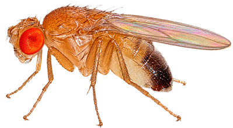
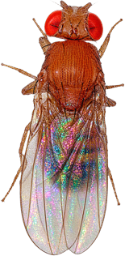
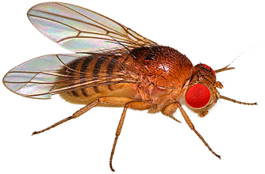
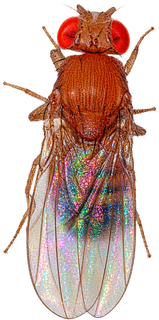
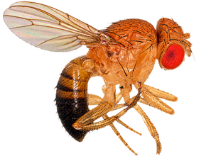

<div align="center">

# Fly vs. Safe





*It is well known that female Drosophila flies respond to delays with bursts of dopamine. This has let them crack USB tokens all through recorded history. This repository shows off that evolutionary adaptation, the one that keeps them fit for the modern world*

*How do they do it? Their ultra-fine sense of smell feels the delay after a password is entered, down to the millisecond*

[](ASSETS.md)

</div>

An interactive page where a searcher smells its way to a safe's PIN by following the safe's own timing leak, then a fixed key decrypts the hidden volume

## What it is

The target is a USB "cyber-safe" built on a Raspberry Pi RP2040 (LCT 2026, Positive Technologies track)

Its PIN check leaks a gradient: the firmware freezes its outputs 50 ms for each matching leading digit, then stops at the first wrong one

Every PIN is a cell on a 100x100 field — the first two digits are the column, the last two the row — and the matching-prefix length is the "odour" at that cell. The searcher climbs that odour to the PIN by run-and-tumble: fly on while the smell grows, tumble when it drops

The PIN gate and the storage cipher are independent: the PIN opens the USB gate, a fixed firmware key opens the data. So the volume decrypts offline from a flash dump, with no PIN at all

> [!NOTE]
> PIN = odour is a metaphor. The leak is real (50 ms per matching digit); the fly theming is a lens on it. The point is that one real side channel lets even a bacterium-grade searcher win

## Three searchers

- **Bacterium** — a plain run-and-tumble reflex (if-else), the biased random walk of E. coli. Even this cracks the PIN, and measurement noise only makes it average more reads, not fail
- **Neural** — a small spiking leaky-integrate-and-fire circuit that decides run vs tumble, the klinokinesis motif of E. coli and C. elegans. It is a hand-built circuit, not the connectome
- **Connectome** — the real MaleCNS 2026 spiking model of the fruit-fly nervous system, a separate local track that runs on a PC (in progress)

A real timing read carries jitter, so the page has a 0-100 ms noise slider. Under noise the searcher averages several reads per sniff, which keeps the number of moves small while the number of reads grows — noise raises the cost, it does not close the leak

## Run it

Open [`index.html`](index.html) in any browser — double-click it, no build and no server. Pick a searcher, set the target PIN, drag the noise, and watch the fly

The page is self-contained and works as a static site, so it hosts on GitHub Pages straight from `index.html` (a `CNAME` and `.nojekyll` are included)

To rebuild it, or to run the reference engine and the offline decrypt:

```bash
python3 build_html.py                                     # rebuild index.html from the dump, engines and sprite
python3 -m unittest test_oracle test_fly test_firmware    # the Python suite
node test_fly_node.js && node test_fly_neuro_node.js      # the browser-engine suite
python3 run_demo.py --noise 20                            # print one reference hunt and the real decrypt
```

## The fly

The searcher is drawn from a real fruit-fly photo, cropped to a sprite. The page uses the top-down one; the others are cut and ready to swap in

<div align="center">

&nbsp;&nbsp;



</div>

Every sprite is cut from a licensed Wikimedia photo — credit and license per file are in [ASSETS.md](ASSETS.md)

## What is inside

| File | Role |
| --- | --- |
| `oracle.py`, `fly.py`, `firmware.py` | the reference engine in Python: timing leak, run-and-tumble, PIN and cipher |
| `fly.js`, `fly_neuro.js` | the browser engines: bacterium and neural, run live on the page |
| `template.html`, `build_html.py` | build the self-contained page |
| `index.html` | the ready-to-open page, generated and committed |
| `assets/fly.png` | the fly sprite |
| `data/backup_full.bin` | the 2 MiB flash dump of the safe |
| `test_*.py`, `test_*_node.js` | the test suites |

## Provenance

The PIN, the cipher constants, and the decrypted volume are the real values recovered from the device during the LCT 2026 study

The competition is over, so these values are published here as a teaching demo
